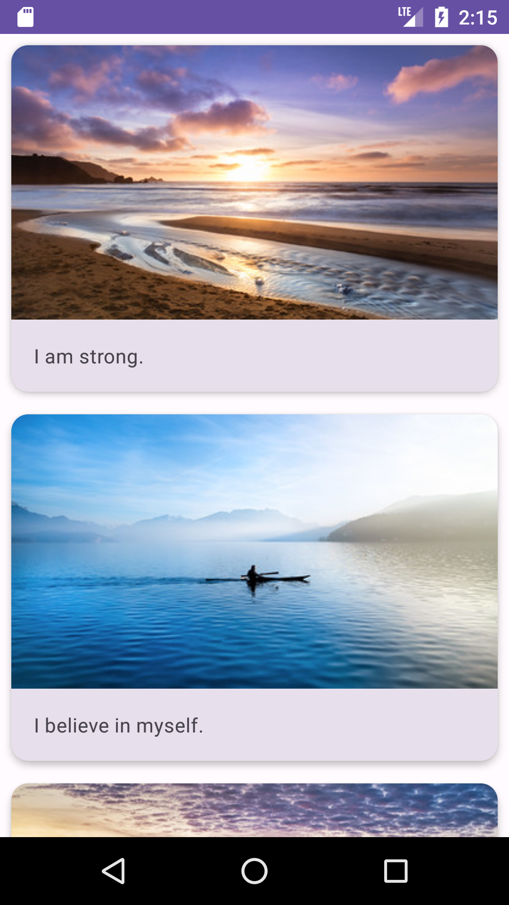

# Affirmations

Affirmations is an Android app designed to help users build a positive mindset and improve their mental health through daily affirmations.

## Screenshot



## Getting Started

1. Clone the repository ```sh git clone https://github.com/gentildpinto/Affirmations.git```
2. Open the project in Android Studio
3. Build and run the app on an emulator or a device

## Built With

The app is built using Kotlin programming language, JetPack Compose, and Material 3, ensuring a modern and seamless user experience.

- [Kotlin](https://kotlinlang.org/) - Programming language
- [Material3 You](https://m3.material.io/) - Design System
- [Jetpack Compose](https://developer.android.com/jetpack/compose) - UI toolkit

## Authors

- **Gentil Pinto** - [gentildpinto](https://github.com/gentildpinto)

## Acknowledgments

- Inspired by the [Google Codelab on Android Basics with Compose](https://developer.android.com/courses/android-basics-compose/course)
